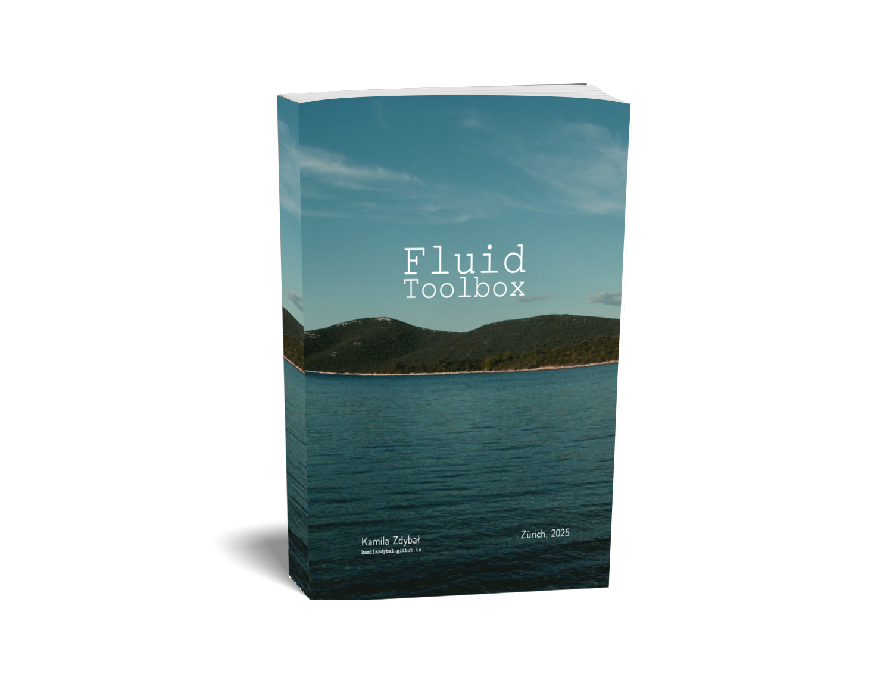

# `Fluid toolbox`

Fluid Toolbox is a collection of human-readable, pseudo-random study notes 
that inspire you to think deeper about various fluid dynamics concepts. 
It is meant to be used complementary to the regular textbook since it may 
provide additional insights, but it will not substitute the thoroughness 
of a standard course in the subject. I believe that working side-by-side 
with a course it can become a useful toolbox of concepts that are ready-to-understand 
and ready-to-use.

This document is still under construction but you can
[download the preview](https://github.com/kamilazdybal/fluid-toolbox/raw/main/fluid-toolbox.pdf)
to see where I’m going with it!